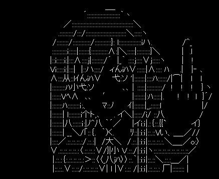

  

#

  <h3>⚝ Backend Student ⚝</h3>
  Python · NodeJS

#

<h3 align="left">Connect with me!</h3>

 
 

<h3 align="left">GitHub Stats</h3>

  

<picture align="center">
  <source media="(prefers-color-scheme: dark)" srcset="https://raw.githubusercontent.com/4idntknow/4idntknow/output/github-contribution-grid-snake-dark.svg">
  <source media="(prefers-color-scheme: light)" srcset="https://raw.githubusercontent.com/4idntknow/4idntknow/output/github-contribution-grid-snake-dark.svg">
  
</picture>
